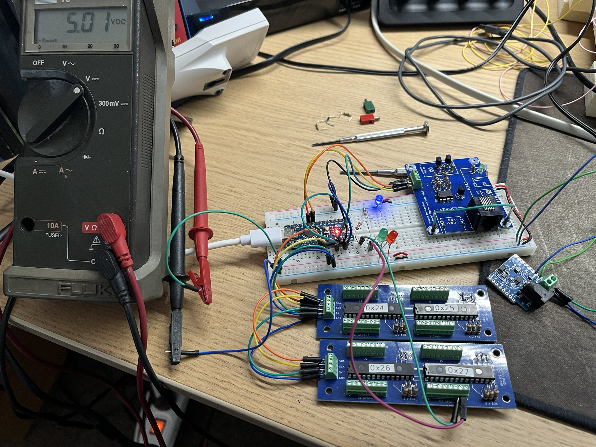

# GAW_Layout_Signals

With this sketch and 4 of my [MCP23017 boards](https://github.com/GerardWassink/GAW_I2C_32port_Expander), one can drive 64 model-railroad two-aspect signals.

Loconet has been added. The signals respond to switch messages.
For my application I'm using a modular layout with 8 modules (60 x 120 cm each).
Addresses are set up as follows:
- M00 to M29 for actual switches
- M30 to M61 for signals
where M is the module number.

## Test-setup
See below for a test-setup with two boards (32 signals).

